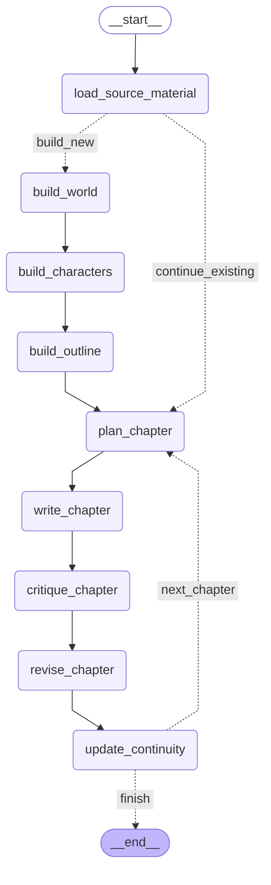

# Novel Agent Flow

```mermaid
---
config:
  flowchart:
    curve: linear
---
graph TD;
	__start__([<p>__start__</p>]):::first
	load_source_material(load_source_material)
	build_world(build_world)
	build_characters(build_characters)
	build_outline(build_outline)
	plan_chapter(plan_chapter)
	write_chapter(write_chapter)
	critique_chapter(critique_chapter)
	revise_chapter(revise_chapter)
	update_continuity(update_continuity)
	__end__([<p>__end__</p>]):::last
	__start__ --> load_source_material;
	build_characters --> build_outline;
	build_outline --> plan_chapter;
	build_world --> build_characters;
	critique_chapter --> revise_chapter;
	load_source_material -. &nbsp;build_new&nbsp; .-> build_world;
	load_source_material -. &nbsp;continue_existing&nbsp; .-> plan_chapter;
	plan_chapter --> write_chapter;
	revise_chapter --> update_continuity;
	update_continuity -. &nbsp;finish&nbsp; .-> __end__;
	update_continuity -. &nbsp;next_chapter&nbsp; .-> plan_chapter;
	write_chapter --> critique_chapter;
	classDef default fill:#f2f0ff,line-height:1.2
	classDef first fill-opacity:0
	classDef last fill:#bfb6fc

```
