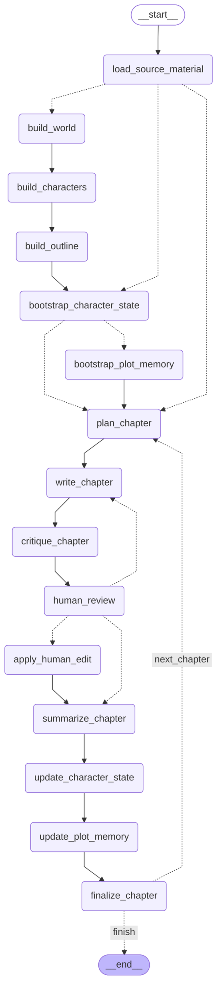

# Novel Agent Flow

```mermaid
---
config:
  flowchart:
    curve: linear
---
graph TD;
	__start__([<p>__start__</p>]):::first
	load_source_material(load_source_material)
	build_world(build_world)
	build_characters(build_characters)
	build_outline(build_outline)
	bootstrap_character_state(bootstrap_character_state)
	bootstrap_plot_memory(bootstrap_plot_memory)
	plan_chapter(plan_chapter)
	write_chapter(write_chapter)
	critique_chapter(critique_chapter)
	human_review(human_review)
	apply_human_edit(apply_human_edit)
	summarize_chapter(summarize_chapter)
	update_character_state(update_character_state)
	update_plot_memory(update_plot_memory)
	finalize_chapter(finalize_chapter)
	__end__([<p>__end__</p>]):::last
	__start__ --> load_source_material;
	apply_human_edit --> summarize_chapter;
	bootstrap_character_state -.-> bootstrap_plot_memory;
	bootstrap_character_state -.-> plan_chapter;
	bootstrap_plot_memory --> plan_chapter;
	build_characters --> build_outline;
	build_outline --> bootstrap_character_state;
	build_world --> build_characters;
	critique_chapter --> human_review;
	finalize_chapter -. &nbsp;finish&nbsp; .-> __end__;
	finalize_chapter -. &nbsp;next_chapter&nbsp; .-> plan_chapter;
	human_review -.-> apply_human_edit;
	human_review -.-> summarize_chapter;
	human_review -.-> write_chapter;
	load_source_material -.-> bootstrap_character_state;
	load_source_material -.-> build_world;
	load_source_material -.-> plan_chapter;
	plan_chapter --> write_chapter;
	summarize_chapter --> update_character_state;
	update_character_state --> update_plot_memory;
	update_plot_memory --> finalize_chapter;
	write_chapter --> critique_chapter;
	classDef default fill:#f2f0ff,line-height:1.2
	classDef first fill-opacity:0
	classDef last fill:#bfb6fc

```
